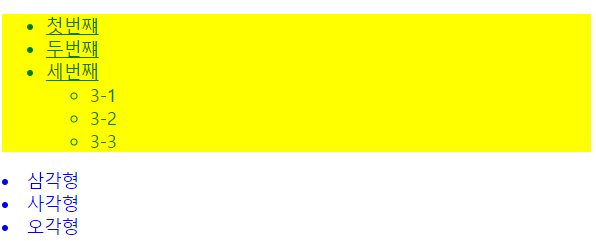

- # MultiCampus-JQuery

  #### JQuery [다운로드](https://jquery.com/download/)

  - JQuery란?

    - 모든 브라우저에서 동작하는 클라이언트 자바스크립트 라이브러리
    - 무료로 사용 가능한 오픈소스 라이브러리

    

  - jQuery는 다음과 같은 기능을 위해 제작되었다

    - 문서 객체 모델과 관련된 처리를 쉽게 구현

    - 일관된 이벤트 연결을 쉽게 구현

    - 시각적 효과를 쉽게 구현

    - Ajax 애플리케이션을 쉽게 개발

      - Ajax : 서버와 javascript를 통해 data를 교환하고, 화면에서 javascript를 통해 액션을 하는 통신기술. Ajax는 웹브라우저와 웹서버가 내부적으로 데이터 통신을 하게 된다. 그리고 변경된 결과를 웹페이지에 프로그래밍적으로 반영함으로써 웹페이지의 로딩 없이 서비스를 사용할 수 있게 한다. 

        - 웹 2.0

        

- Selector : 선택자 (CSS의 선택자와 거의 유사함)

  - DOM에서 특정 위치 지정
  - 선택자의 종류(기본 선택자)
    - $("*") : 전체 선택자
    - $(".class") : 클래스 선택자
    - $("#id") : 아이디 선택자
    - $("element") : 요소(태그, element) 선택자
    - $("selector1, selector2, ... ,selectorN") : 다중 선택자(multiple selector)

 

  - DOM 객체

  - 

  - 자식 선택자 : $("parent>child")

- 후손 선택자 : $("parent child")

  ```javascript
    <script>
          $(function(){
              $("div *").css('color', 'blue');
              $("ul").css('background', 'yellow');
              // id가 menu인 ul 태그 아래 있는 모든 li 태그의 색을 변경
              $("ul#menu li").css('color', 'green');
              // id가 menu인 ul 태그 '바로' 아래 있는 li 태그에 대해 밑줄을 삽입
              $("ul#menu>li").css('text-decoration', 'underline');
  
          });
      </script>
  </head>
  
  <body>
      <div>
          <ul id ="menu">
              <li>첫번쨰</li>
              <li>두번쨰</li>
              <li>세번째</li>
              <ul>
                  <li>3-1</li>
                  <li>3-2</li>
                  <li>3-3</li>
              </ul>
          </ul>
              <li>삼각형</li>
              <li>사각형</li>
              <li>오각형</li>
          <ol>
          </ol>
      </div>
  </body>
  ```
  
  
  
- 속성 선택자

  - 주로 <form> 아래에서 사용하는 사용자 입력을 처리하는 태그를 제어할 때 사용
  
  ```javascript
  <head>
      <script src="node_modules/jquery/dist/jquery.js"></script>
      <script>
          $(function () {
              // 속성 선택자
              // $(엘리먼트이름[속성이름='속성값'])
              $('ul[id="submenu"] li').css('color', 'red');
              $('ul#submenu li').css('background', 'yellow');
          })
      </script>
  </head>
  
  <body>
      <div>
          <ul id="menu">
              <li>첫번쨰</li>
              <li>두번쨰</li>
              <li>세번째</li>
              <ul id="submenu">
                  <li>3-1</li>
                  <li>3-2</li>
                  <li>3-3</li>
              </ul>
          </ul>
          <li>삼각형</li>
          <li>사각형</li>
          <li>오각형</li>
          <ol>
          </ol>
  </body>
  
  ```
  
  